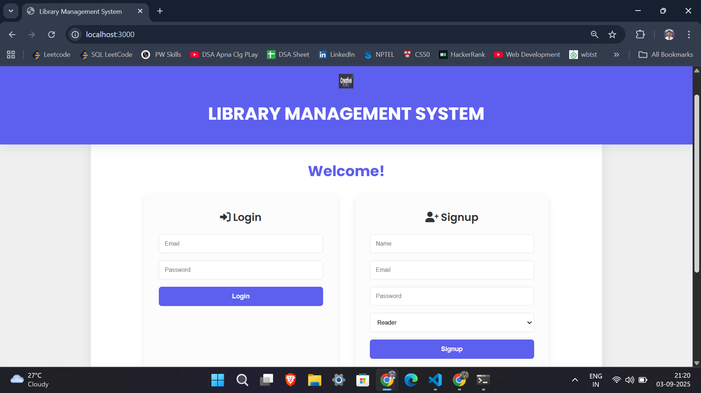

# 📚 Library Management System  

A modern **Library Management Website** built with **HTML, CSS, JavaScript, and Node.js**, designed to digitize and simplify library operations.  
It supports two types of users — **Readers** and **Librarians** — and uses **JSON storage** for seamless data management.  

---

### 🛠️ Tech Stack
<div align="center">
  <!-- Frontend -->
  
  
  
  
  <!-- Backend -->
  
  
  
  <!-- Tools -->
  
  
  
  
  <!-- OS -->
  
</div>

## 📸 Screenshots (Demo)  

<p align="center">
  
</p>

---

## 🌟 Smart Recommendation Engine  

One of the **standout features** of this project is the **AI-like smart recommendation system**:  

- 📚 Suggests books to Readers based on:  
  - Categories / Genres  
  - Authors they’ve read before  
  - Previously borrowed history  
- 🎯 Helps Librarians understand popular demand.  

This makes the library experience **personalized and engaging**, just like modern e-book platforms!  

---

## 🚀 Features  

### 👩‍🏫 Librarian
- ➕ Add new books (title, author, copies, date, cover photo).  
- 🗑️ Delete or update book details.  
- 📊 Manage the entire book collection.  

### 📖 Reader
- 🔍 Search and view books with details.  
- 📥 Borrow and return books.  
- 🤖 Get **smart recommendations** tailored to reading habits.  

### ⚙️ System
- 📂 Data stored in **JSON files** (`users.json`, `books.json`) for portability.  
- 🔐 Secure authentication for both Reader & Librarian roles.  
- 🌐 Node.js backend for dynamic operations.  

---

## 🛠️ Tech Stack  

- **Frontend:** HTML, CSS, JavaScript  
- **Backend:** Node.js  
- **Storage:** JSON (`users.json`, `books.json`)  

---


## 🏗️ Installation & Setup  

Clone the repo:  
```bash
git clone https://github.com/nafeeshossain/library-management-system.git
cd library-management-system
